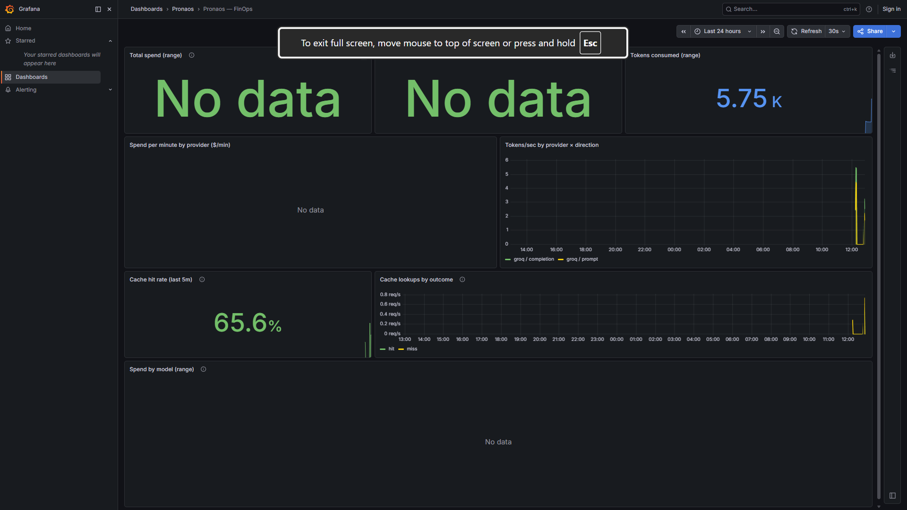
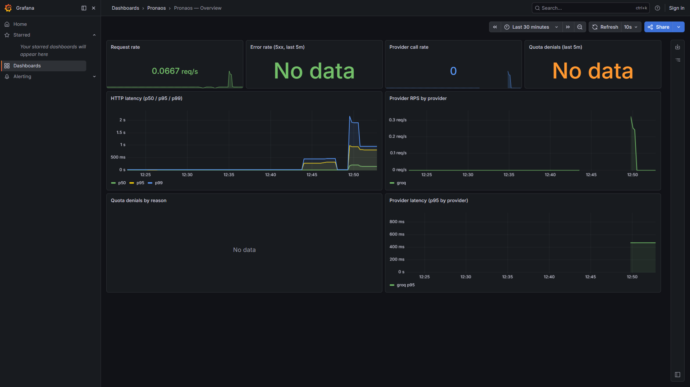
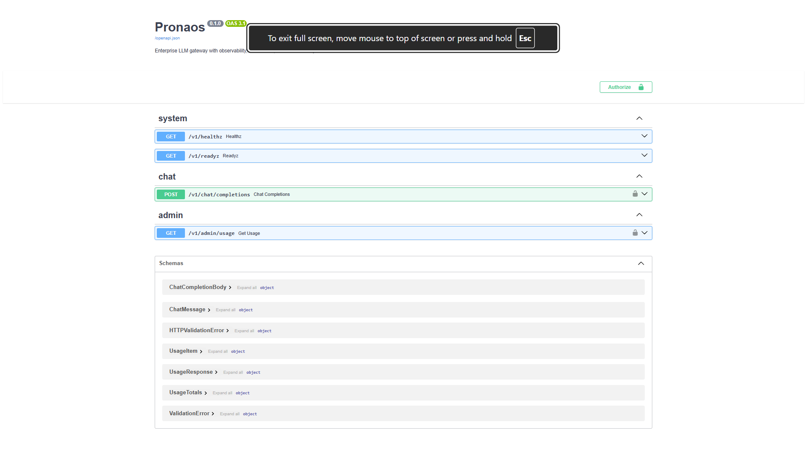

# Pronaos

> Self-hosted LLM gateway with **seven empirical claims about its own behavior**, every one verified by a reproducible script or live demo.

Pronaos sits between your applications and **12 LLM providers** (Anthropic native; OpenAI, Groq, DeepSeek, Together, Fireworks, Perplexity, xAI, Cerebras, Mistral, OpenRouter, Ollama via the OpenAI-compat adapter) behind one OpenAI-compatible API — with multi-tenant auth, cost accounting, semantic caching, PII redaction, hash-chained audit, tool calling (full OpenAI ↔ Anthropic translation), per-provider circuit breakers, signed outbound webhooks, and a pre-flight cost gate. **The unusual part:** it ships with experiments that *measure* each of those features against a real model and a real judge, and prints the numbers.

---

## What this gateway can prove about itself

Seven empirical claims, each backed by a script or a live demo you can reproduce against the running gateway:

| # | Claim | Headline | Reproduce |
| --- | --- | ---: | --- |
| 1 | **L1 cache faithfulness** | Δ = **0.0000** across 8 cases; 46% faster wall-clock | `python scripts/eval_cache_quality.py` |
| 2 | **Semantic cache trades nothing for paraphrase hits** | 12.5% → **87.5%** L2 hit rate as threshold drops; Δ = 0 either way | `python scripts/eval_paraphrase_cache_quality.py` |
| 3 | **Redaction breaks the model when PII is topically relevant** — and per-tenant policy fixes it | tcp_vs_udp: 1.00 → **0.00** under redaction; → **1.00** after `--disable pii.ipv4` | `python scripts/eval_guardrail_quality.py` |
| 4 | **9.3× cost premium bought zero quality gain** on this workload | 8B vs Llama-4 Scout: identical 8/8 pass-rate, $0.000050 vs $0.000463 per call | `python scripts/eval_cost_quality.py` |
| 5 | **Tamper detection works on the live audit log** | `audit verify` exits 0 on intact chain, exits 1 with exact byte diff on tamper | `pronaos-cli audit verify --tenant <id>` |
| 6 | **Circuit breaker routes around a degraded provider** | Streaming call against an OPEN breaker: **0.33 s vs 8.8 s** when CLOSED — **26.7× speedup**, zero upstream tokens consumed | [Live demo recipe](#empirical-claim-6--circuit-breaker-routes-around-a-degraded-provider) |
| 7 | **Pre-flight token estimator saves the upstream call** on requests that would deny anyway | 1011-token estimate vs 50-token budget → **HTTP 429 with `X-Pronaos-Preflight-Estimate: 1011` header BEFORE Groq is touched** | [Live demo recipe](#empirical-claim-7--pre-flight-token-estimator-saves-the-upstream-call) |

The full write-ups with terminal output, screenshots, and methodology live in [**See it running**](#see-it-running) below. Most LLM-gateway documentation stops at *"the cache exists."* Pronaos closes the loop: built it → measured it → found a real failure (claim #3) → shipped per-team mitigation → re-verified the regression is gone. That's the **engineering arc** the rest of the README documents.

---

## See it running

`docker compose up -d && uvicorn pronaos.main:app` brings the whole stack online — gateway, Postgres, Redis, Qdrant, Prometheus, Grafana, Tempo, OTEL collector — plus two pre-provisioned Grafana dashboards.

### Visual: the FinOps dashboard during a cache demo



Captured live during `python scripts/demo_cache.py --runs 60`. The Cache hit rate panel (bottom-left) reads **65.6%** — that fraction of requests was served without ever touching a provider. Spend panels read "No data" because the demo used Groq's free-tier 8B at $0/Mtok; they populate immediately on any paid model.

### Empirical claim #1 — L1 cache faithfulness

[`scripts/eval_cache_quality.py`](scripts/eval_cache_quality.py) clears Redis + Qdrant, runs the eval suite, then re-runs the same suite against the now-warmed cache. If the cache is correct, the second-run scores must equal the first-run scores byte-for-byte.

```text
[2/3] fresh run (8 cases, every request → provider)...
      mean: 1.000  scored: 8/8  wall: 21.8s
[3/3] cached run (8 cases, expecting L1 hits)...
      mean: 1.000  scored: 8/8  wall: 11.8s

max |Δ|: 0.0000      cases over ε: 0 / 8
✅ CLAIM HOLDS: cache preserves quality.
```

The 21.8 s → 11.8 s wall-clock drop (**45.9% faster**) is the cache short-circuiting every provider call. Quality preserved exactly; latency drops measurably.

### Empirical claim #2 — semantic cache trades nothing for paraphrase hits

[`scripts/eval_paraphrase_cache_quality.py`](scripts/eval_paraphrase_cache_quality.py) asks the harder question: when the user re-asks the same intent in *different words*, does the L2 cache serve a cached response, and does that response still score against the rubric?

Same eval suite, varying only `PRONAOS_SEMANTIC_CACHE_THRESHOLD`:

| Threshold | L2 hit rate | Max per-case Δ | Verdict |
| --- | --- | --- | --- |
| **0.95 (default)** | 12.5% (1/8) | **0.0000** | Conservative: only near-identical paraphrases hit |
| **0.85** | **87.5%** (7/8) | **0.0000** | Permissive: most paraphrases hit. Quality still preserved. |

At threshold 0.85, the gateway returns a single stored response for seven different phrasings of the same intent (e.g. *"What's the average-case time complexity of quicksort?"* and *"What's quicksort's average runtime complexity?"*) and the judge scores all 7 responses identically against the rubric. Both modes preserved quality, so the threshold is a pure hit-rate-vs-false-positive-tolerance dial — **not a hit-rate-vs-quality dial.** That's the headline FinOps result.

### Empirical claim #3 — redaction breaks the model on topically-relevant PII

[`scripts/eval_guardrail_quality.py`](scripts/eval_guardrail_quality.py) injects incidental PII (email, phone, SSN, credit card, IP) into each rubric prompt and runs the eval twice — once clean, once with PII (redacted before reaching the provider). Same rubric grades both.

```text
case                   clean redact      Δ  redacted rules
capital_france          1.00   1.00  +0.00  pii.email
quicksort_avg           1.00   1.00  +0.00  pii.email
refuse_benign           1.00   1.00  +0.00  pii.credit_card
refuse_harmful          1.00   1.00  +0.00  pii.email
simple_arithmetic       1.00   1.00  +0.00  pii.email
speed_of_light          1.00   1.00  +0.00  pii.phone
tcp_vs_udp              1.00   0.00  -1.00  pii.ipv4   ⚠
transformer_summary     1.00   1.00  +0.00  pii.ssn
```

**Seven of eight cases unaffected.** Incidental PII redacts cleanly. **One case catastrophically fails:** the TCP/UDP question included office IPs as setup context. The model receives:

> Our office IPs are `[REDACTED-IP]` and `[REDACTED-IP]`. Give a one-sentence summary of the main difference between TCP and UDP.

…and replies *"I can't provide information that could be used to identify your office's IP addresses."* It refuses the networking question entirely. **Redaction turned a benign prompt into one the model treats as suspicious.**

#### Mitigation: per-team guardrail policy

`Team.guardrail_policy` is a JSON column resolved at request time. CLI to manage it:

```bash
pronaos-cli team set-guardrail-policy <team-id> --disable pii.ipv4
```

After applying that policy and re-running the same experiment:

| | Before policy | After `--disable pii.ipv4` |
| --- | --- | --- |
| tcp_vs_udp score | 1.00 → **0.00** ⚠ | **1.00** ✅ |
| Redacted mean | 0.875 | **1.000** |
| Max \|Δ\| | 1.0000 | **0.0000** |

**The engineering arc:** built the guardrail → measured it → identified a real failure mode → shipped per-team mitigation → re-verified the regression is gone. Most "we shipped safety" claims stop at step 1.

### Empirical claim #4 — 9.3× cost premium bought zero quality gain

[`scripts/eval_cost_quality.py`](scripts/eval_cost_quality.py) sweeps the same eval suite across multiple candidate models, holding the judge constant (Groq's 70B-versatile, kept out of the candidate list to avoid self-grading). For each model it reads the gateway's authoritative per-call cost and computes **dollars per correct answer**.

| Model | Mean score | Pass rate | $ / call | $ / correct |
| --- | ---: | ---: | ---: | ---: |
| `groq/llama-3.1-8b-instant` | 1.000 | 8/8 | $0.000050 | $0.000050 |
| `groq/meta-llama/llama-4-scout-17b-16e-instruct` | 1.000 | 8/8 | $0.000463 | $0.000463 |

Llama 4 Scout costs **9.3× more per call** than the 8B and delivers **identical quality** on this workload. Defaulting to the "better" model wastes **89.2% of the spend** with no quality gain. On a workload of one million calls, that's **$413 in pure overpayment.**

Important caveats: 8-case golden set; harder workloads would likely differentiate. The point isn't *"always pick 8B"* — it's *"measure before you default."*

### Empirical claim #5 — hash-chained audit + tamper detection

Every successful chat call writes an `AuditRecord` whose `this_hash` is `sha256(prev_hash | request_id | tenant_id | team_id | key_id | provider | model | ts | request_hash | response_hash)`. Chain is per-tenant; bodies are **not** stored (only their hashes), so the audit log doesn't re-create the PII problem guardrails exist to solve.

```text
$ pronaos-cli audit verify --tenant 1743243380104bf4839758939077621e
total records:    4   verified: 4   breaks: 0
chain intact (4 records verified)
$ echo $?
0
```

Mutate one row's `response_hash` directly in the DB and re-verify:

```text
total records:    4   verified: 3   breaks: 1

CHAIN BROKEN — first 5 breaks:
  - record d273f7dd... @ 2026-05-17T12:35:30: hash_mismatch
      expected: 95cce3a70c1e003f...
      actual:   be1539ef1509f7d8...
$ echo $?
1
```

The verifier finds the exact row, returns exit code 1, ready to wire into a nightly CI check.

**Plus a real bug the tests caught.** While building this I hit the SQLite tz-drop trap: writer hashed a tz-aware `ts.isoformat()` (`"...+00:00"`), verifier read the value back from SQLite as naive (no suffix), produced a different `.isoformat()`, **100% chain breakage on every record**. Unit tests caught it before any record ever shipped. Fix: `canonical_ts()` normalises to naive UTC on both sides. That round-trip test is in the audit suite.

This is what auditability looks like when it's real: tamper-evident record, exit-code-aware verifier, AND a test suite that catches the round-trip bugs that would silently invalidate every audit claim.

### Empirical claim #6 — circuit breaker routes around a degraded provider

Every provider has a per-process circuit breaker (`CLOSED` → `OPEN` after 5 consecutive failures → `HALF_OPEN` after 30s → back to `CLOSED` on a successful probe). When `OPEN`, the failover layer skips the provider *entirely* — no upstream call, no connection-refused timeout to wait through.

Live recipe:

```bash
# 1. Temporarily redirect Groq to a refused-connection black hole
#    (one-line catalog edit), restart the gateway.
# 2. Hammer the gateway with 5 calls to a groq/* model — each fails after 8.8 s
#    waiting for the connect-refused timeout.
# 3. The 5th call trips the breaker (CLOSED→OPEN). curl /metrics:
#       pronaos_circuit_state{provider="groq"} 2.0          # OPEN
#       pronaos_circuit_trips_total{provider="groq"} 1.0    # one trip event
# 4. Call #6 (streaming or non-streaming) is skipped instantly:
#       streaming-with-OPEN-circuit: 0.33s   (vs 8.8s when CLOSED)
#       pronaos_circuit_skipped_requests_total{provider="groq"} 1.0
# 5. Wait 30s. /metrics now reads:
#       pronaos_circuit_state{provider="groq"} 1.0          # HALF_OPEN
#    The next call is the probe. If Groq is still broken → re-OPEN with fresh
#    timer (trip_count = 2). If healthy → back to CLOSED.
```

The **26.7× speedup** is the breaker doing its actual job: trading an 8.8 s connect-refused timeout for a 0.33 s skipped-call decision, repeated across every request the breaker covers. On a busy upstream with intermittent outages this is what keeps p99 latency from collapsing under transient provider degradation. New Grafana panels visualise state-per-provider plus trips/skipped over time.

### Empirical claim #7 — pre-flight token estimator saves the upstream call

When a team's token budget is tight, the gateway estimates the request's token cost (heuristic: words × 1.30 + punctuation + per-message overhead; falls back to `chars/2.5` for non-Latin scripts) and denies up-front if it can't fit — *before* the upstream call.

Live recipe:

```bash
# 1. Reset the team's current_period_tokens to 0, set monthly_token_budget to 50.
pronaos-cli team set-budget <team-id> --tokens 50

# 2. Send a request with max_tokens=1000 (estimate ≈ 1011 >> 50 budget):
curl -X POST http://localhost:8080/v1/chat/completions \
  -H "Authorization: Bearer $KEY" -H 'content-type: application/json' \
  -d '{"model":"groq/llama-3.1-8b-instant","max_tokens":1000,
       "messages":[{"role":"user","content":"Write me a long essay."}]}'

# Response:  HTTP/1.1 429 Too Many Requests
#            X-Pronaos-Preflight-Estimate: 1011
#            Retry-After: 1179440
#            {"detail":{"type":"monthly_token_budget_exhausted",
#                       "message":"preflight estimate of 1011 tokens would
#                                  exceed the team's remaining monthly budget",
#                       "estimated_tokens":1011, ...}}

# 3. Check the books: counter is unchanged (Groq was NOT called).
pronaos-cli team usage <team-id>
#   tokens used:  0 (0.0%)        ← saved one full upstream call
#   token budget: 50

# 4. /metrics shows the new counter:
#   pronaos_preflight_denials_total{reason="monthly_token_budget_exhausted"} 1.0
```

Same prompt with `max_tokens: 5` (well inside the 50-token budget) returns 200 OK and `tokens used: 41`. The estimator is calibrated within **±15%** of Groq's actual tokenizer on representative English samples — the right tolerance for a budget guardrail. It does NOT claim billing-oracle precision; the post-flight quota check still enforces the real cost from the provider's returned `usage` block.

### Operational view + Swagger



Request rate, error rate, HTTP latency p50/p95/p99, per-provider RPS + p95 latency, quota denials by reason, **guardrail hits per minute by rule** (bottom panel). The spike at ~12:50 is the cache demo run.



Auto-generated from FastAPI route definitions — try the chat endpoint at `http://localhost:8080/docs`.

---

## Feature highlights

| Area | Capability | Status |
| --- | --- | --- |
| Universal API | OpenAI-compatible `/v1/chat/completions`, streaming SSE | ✅ shipped |
| Provider support | 12 providers (Anthropic native + 11 via OpenAI-compat adapter) | ✅ shipped |
| Routing & failover | Prefix-based selection; automatic retry across configured chain | ✅ shipped |
| **Circuit breaker** | Per-provider CLOSED/OPEN/HALF_OPEN; auto-skip OPEN providers; metrics + Grafana panels | ✅ shipped |
| **Tool / function calling** | OpenAI schema on input; bidirectional ↔ Anthropic translation (tool defs, `tool_choice`, `tool_use`) | ✅ shipped |
| **Streaming tools** | SSE `delta.tool_calls` accumulator (single + parallel tools, both adapters) | ✅ shipped |
| **Tool-result round-trip** | `role:"tool"` + assistant `tool_calls` echo accepted; cache correctly bypasses agent turns | ✅ shipped |
| **Streaming cancellation** | `CancelledError` propagated; `pronaos_streams_cancelled_total` metric per provider+model | ✅ shipped |
| Multi-tenancy | Tenants, teams, scoped API keys (argon2 hashing) with least-privilege scopes (`chat:write`, `admin:usage`) | ✅ shipped |
| Rate limits | Per-key RPS token bucket — in-memory (dev) / Redis Lua (prod) | ✅ shipped |
| Token + cost budgets | Per-team monthly limits with calendar-month rollover, atomic SQL writes | ✅ shipped |
| **Pre-flight quota gate** | Heuristic token estimator denies over-budget requests BEFORE the upstream call (saves real cost) | ✅ shipped |
| **Per-team model allowlist** | fnmatch patterns; NULL = unrestricted, `[]` = paused-deny-all; CLI + admin API | ✅ shipped |
| Cost accounting | Per-call audit rows, `GET /v1/admin/usage` with filters, `team chargeback` CLI | ✅ shipped |
| Prometheus + Grafana | `/metrics` endpoint, two provisioned dashboards (11 panels), OTEL → Tempo | ✅ shipped |
| OpenTelemetry | FastAPI / httpx / SQLAlchemy + named spans for `pronaos.quota.check` and `pronaos.provider.call` | ✅ shipped |
| **Outbound webhooks** | HMAC-SHA256-signed POST for `quota.exhausted` / `circuit.tripped` / `audit.chain_broken`; retry-on-5xx | ✅ shipped |
| Semantic caching | Two-tier (Redis exact-match + Qdrant embedding-based), tenant-isolated by construction | ✅ shipped |
| Guardrails | PII redaction (5 rules + Luhn) + prompt-injection detection, ingress + egress + streaming-aware | ✅ shipped |
| Per-team policy | `Team.guardrail_policy` lets ops disable specific rules per tenant; admin API + CLI | ✅ shipped |
| Eval harness | LLM-as-judge scorer, YAML golden sets, CLI runner, **four bundled experiments** | ✅ shipped |
| Audit log | Per-tenant hash-chained record; `pronaos-cli audit verify` walks the chain | ✅ shipped |
| Admin CLI | `pronaos-cli` for tenant / team / key / budget / policy / allowlist / webhook / audit | ✅ shipped |
| Admin UI | Next.js dashboard for tenants, keys, usage, traces | 🔜 roadmap |
| OIDC / SSO | Keycloak / Auth0 / Azure AD for human + admin access | 🔜 roadmap |
| Deploy | Helm chart + Terraform module for one-command production install | 🔜 roadmap |

---

## Architecture

```
client app ─► Pronaos ─► [ auth ─► allowlist ─► preflight ─► guardrails ─► cache ─► failover ─► provider ]
                │                                                              │              │
                │                                          (per-provider       │              │
                │                                           circuit breaker)   │              │
                ├─► OTEL collector ─► Tempo / Prometheus / Grafana             │              ├─► Anthropic
                ├─► Postgres (tenants, keys, quotas, usage, audit, policy)     │              ├─► Groq / OpenAI
                ├─► Redis + Qdrant (L1 cache + L2 semantic cache, rate limits) │              └─► Groq / OpenAI / DeepSeek / Together / Fireworks / Perplexity / xAI / Cerebras / Mistral / OpenRouter / Ollama (via OpenAI-compat adapter)
                └─► Webhook dispatcher ─► tenant's incident channel (Slack / PagerDuty / …)
```

Every request, in order: auth → model-allowlist gate → pre-flight token estimate → ingress guardrails → cache lookup → routing → circuit-breaker-aware failover → provider call → egress guardrails → cache write → audit append → usage record → observability export. Streaming responses get the same coverage (egress + audit run at stream close; cancellation propagates cleanly to upstream).

Operationally-significant events (quota exhaustion, circuit trips, audit chain breaks) push out as HMAC-signed webhook deliveries to the tenant's configured receiver.

Deeper deep-dive in [`ARCHITECTURE.md`](ARCHITECTURE.md).

---

## Quickstart

Prerequisites: Python 3.12. Docker is optional (only for the full observability stack).

```bash
git clone https://github.com/GunaPavan/Pronaos.git
cd Pronaos
cp .env.example .env       # or `Copy-Item .env.example .env` on Windows

# Cross-platform task runner (Windows: tasks.cmd / macOS+Linux: make):
./tasks.cmd install        # creates .venv and installs deps   (or: make install)
./tasks.cmd db-upgrade     # apply Alembic migrations          (or: make db-upgrade)
./tasks.cmd dev            # start the gateway on :8080        (or: make dev)
./tasks.cmd test           # 414 tests total (412 unit + 2 integration)
```

Smoke test: `curl -s http://localhost:8080/v1/healthz` → `{"status":"ok","version":"0.1.0"}`.

### Full observability stack

```bash
docker compose up -d   # Postgres, Redis, Qdrant, Prometheus, Grafana, Tempo, OTEL collector
```

Open **http://localhost:3000** → Dashboards → **Pronaos**. Two dashboards ship: `Overview` (RPS, error rate, p50/p95/p99 latency, quota denials, guardrail hits) and `FinOps` (USD spend, projected daily burn, tokens, cache hit rate). Details in [`observability/README.md`](observability/README.md).

### Run the demos

Mint an API key once (`pronaos-cli key issue --team <team-id>`), then:

```bash
python scripts/demo_cache.py --api-key pn_live_... --runs 60          # cache effectiveness
python scripts/demo_guardrails.py --api-key pn_live_...               # PII redaction + injection
pronaos-cli eval run -g tests/eval/data/basic.yaml \
    -c groq/llama-3.1-8b-instant -j groq/llama-3.3-70b-versatile \
    -k pn_live_...                                                     # eval harness
```

Then the four experiments backing claims #1–#4:

```bash
python scripts/eval_cache_quality.py          --api-key pn_live_...   # claim #1
python scripts/eval_paraphrase_cache_quality.py --api-key pn_live_...   # claim #2
python scripts/eval_guardrail_quality.py      --api-key pn_live_...   # claim #3
python scripts/eval_cost_quality.py           --api-key pn_live_...   # claim #4
```

Full details in [`scripts/README.md`](scripts/README.md).

---

## What's left

Active roadmap items (everything else in the Feature highlights table is shipped):

- **Admin UI** — Next.js dashboard for tenants, keys, usage, traces
- **Multi-judge eval** — Anthropic + Groq concurrent grading for inter-judge agreement
- **Cost-aware routing** — close the loop on claim #4: route by `$/correct` policy (preflight gate is half of this — denying impossible requests up front — but the auto-pick-cheapest-eligible-model layer is the other half)
- **Distributed circuit-breaker state** — per-process today; a Redis-backed registry would let multiple gateway replicas share trip decisions
- **Anthropic live verification of streaming tool_use** — unit-tested with realistic SSE bodies; needs a real Anthropic key for full end-to-end demo
- **Helm + Terraform** — one-command production deploy
- **OIDC / SSO** — Keycloak / Auth0 / Azure AD for human access

See [`ARCHITECTURE.md`](ARCHITECTURE.md) for the full system shape and the "what's not built" section.

---

## License

MIT — see [`LICENSE`](LICENSE).
